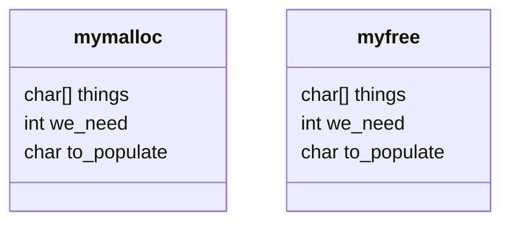

# My Little Malloc

Creation of a `mymalloc()` library for Rutgers University class: `01:198:214` - Systems Programming

Created by: **Emily Cao** (ec1042) and **Ivan Zheng** (iz60)

```mermaid
classDiagram
    class mymalloc {
        char[] things
        int we_need
        char to_populate
    }

	class myfree {
		char[] things
		int we_need
		char to_populate
	}
```

